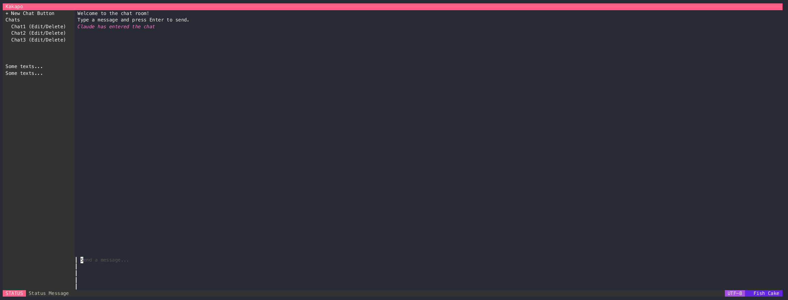

# kakapo 🦜
> 🚧 This is a work in progress. 🚧

This program is a terminal-based chat interface that integrates with an AI-powered conversational agent. Built using Bubble Tea and Langchain Go, it provides a straightforward yet interactive user experience.

## Features
- 🚧 **User Interaction**: Allows users to input messages via a text area, sending messages by hitting "Enter."
- 🚧 **Viewport Displays**: Displays chat messages in a viewport, updating in real-time as new messages are sent.
- 🚧 **Sidebar Information**: Includes a sidebar for additional content or information.
- 🚧 **AI Integration**: Utilizes LLMs to provide AI-driven responses to user queries.

## Usage
1. Start: Launch the application to access the chat interface.
2. Input: Type messages into the text area and press "Enter" to send.
3. Responses: AI-driven responses from Claude will display in the chat viewport.
4. Exit: Exit the application using "Ctrl+C" or "Esc."

## Dependencies
- **Bubble Tea**: Terminal-based user interface library for Golang.
- **Lip Gloss**: Library for styling terminal output.
- **Consolesize-Go**: Package to obtain console size.
- **LangChaingo**: Language models for conversational AI.

## Current supported LLMs
- [x] AWS Bedrock
  - [x] `anthropic.claude-v2`
  - [x] `anthropic.claude`
- [ ] `ollama.llama`
- [ ] `ollama.llama2`
- [ ] `openai.gpt-3_5`
- [ ] `openai.gpt-4`

## TODO
Refer to this [TODO](TODO.md) list.
